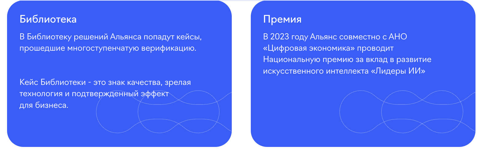

# AI Russia: каталог на 4 992 сценария и 13 кейсов



> Небольшой воспроизводимый аудит того, как «много ИИ» выглядит в анонимном
> публичном API — когда витрина уже бесконечна, а связанный кейс всё ещё надо
> искать с фонариком.

Здесь нет расследования «всё ли внедрено», разоблачения века или попытки
перепутать красивую карточку с бухгалтерской отчётностью. Здесь есть более
скучная и потому полезная вещь: скрипт считает то, что сайт сам отдаёт
публично, и не называет первую страницу базы её полным размером. Революционно,
согласны.

- фиксирует `4 992` сценария, `1 000` ячеек матрицы и их распределение;
- находит `13` уникальных публично привязанных case ID: 9 у Альфа-Банка и 4 у
  Яндекса в снимке от 24 августа 2026 года;
- отделяет сценарий от кейса, а кейс в API — от независимого подтверждения
  эффекта;
- проверяется офлайн на сохранённом образце API, без героического DDoS «ради
  прозрачности»;
- хранит исходный аудит, исправленную v2-версию и проверяемые CSV/JSON-сводки.

## Быстрый старт

```bash
git clone https://github.com/megamen32/ai-russia-public-api-audit.git && cd ai-russia-public-api-audit && python3 -m pip install -r requirements.txt && python3 archive/v2/ai_russia_api_audit_v2.py --fixture archive/v2/api_samples.json --out fixture_report
```

Команда запускает офлайн-канарейку v2 на приложенном сохранённом ответе API.
Она не делает сетевых запросов; итог появится в `fixture_report/`.

## Что зафиксировано

| Публичный срез на 24.08.2026 | Значение |
| --- | ---: |
| Сценарии в `total` API | 4 992 |
| Проверенные ячейки отраслевой матрицы | 1 000 |
| Ячейки с `hasCases=true` | 10 |
| Уникальные публично связанные case ID | 13 |
| Отрасли без ячеек с кейсами | 8 из 10 |

Подробности — в [итоговом JSON](summary_final.json) и
[таблице 13 записей](evidence/all_13_publicly_linked_cases.csv). Число 13 —
это не «13 внедрений во всей России» и не оценка ценности чьей-либо работы. Это
ровно 13 записей, которые текущий публичный API сайта связал со сценариями.
Каталог — не аудит внедрений, как меню — не отчёт о том, что было съедено.

## Запуск живого обхода

```bash
python3 ai_russia_api_audit.py --out ai_russia_api_dump --verbose
```

Это обращается к публичному `ai-russia.ru`, сохраняет ответы локально и
ограничивает повторы временных ошибок. Не запускайте его ради коллекции
таймаутов: офлайн-проверка выше достаточна для проверки репозитория.

## Документация

- [Методология и границы вывода](docs/METHODOLOGY.md)
- [Исправления второй итерации](archive/v2/KNOWN_CORRECTIONS_AI_RUSSIA.md)
- [Офлайн-отчёт v2](archive/v2/fixture_report/report.md)
- [Исходный пост](POST_1024.md)

## Лицензия и источники

Код и созданные в этом репозитории сводки публикуются для проверки и
обсуждения. Сторонний PDF-кейсбук из исходного набора намеренно не включён:
права на его публичное распространение не установлены. Этот репозиторий
фиксирует интерфейс и ответы, а не присваивает себе чужие материалы или право
говорить от имени сайта.
